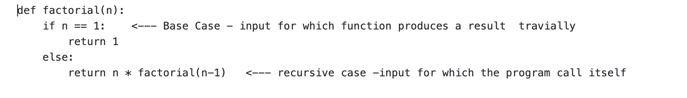

# Week1- relection--> tutorial by Jimmy Zhang
## Paradigm 
A **Paradigm** is a way to classifying programming language according to the style in which program are written in that language  
There are several kinds of major programming paradigms:
1. Imperative language 
2. Logical language 
3. Functional language 
4. Object-Oriented language 

Each of those paradigm can solve using the others,however certain kinds of problems can be solve efficiently using a specific paradigms.

# Imperative language
It is also popular language due to how closely how resembles the actual machine itself, so the programmer is much closer to the machine.

**Advantage:**
- efficient
- close to the machine
- popular
- familiar

**Disadvantage:**
- something it is hard to debugging
- Abstration is more limitted than with some paradigms
- Order is crucial, which doesn't always suit itself to problems.

**Ex:** C, Fortran, Cobol
# Logical language 
Rules and facts derived by the programmer, logic engine infer answers to question.

**Advantage:**
- The system solves the problem, so the programming steps themselves are kept to a minimum

**Ex:** Prolog, Maude
# Functional language 
Mathematical functions used as building blocks of a program

**Advantage:**
- Recursion and single valued variables
- The lack of dependence on assignment operations, allowing programs to be evaluated in many different orders. This evaluation order independence makes function-oriented languages good candidates for programming massively parallel computers;
- The absence of assignment operations makes the function-oriented programs much more amenable to mathematical proof and analysis than are imperative programs

**Disadvantage:**
- Maybe less efficiency 
- Problems involving many variables or a lot of sequential activity can sometimes be easier to handle imperatively or with object-oriented programming.

**Ex:** ML,Lisp,Haskell
# Object-Oriented language 
object created with a state and behavior method called.

**Advantage:**
- The ability to use inheritance is the single most distinguishing feature of the OOP paradigm. Inheritance gives OOP its chief benefit over other programming paradigms - relatively easy code reuse and extension without the need to change existing source code.
- The encapsulation and information hiding are inherent benefits of OOP.

**Ex:** C++,Java, Smalltalk

--------------------------------------------------------------------------------------------------

# Recursion
When a function called itself, it is **recursive** and using a recursive function it is know to be **recursion**.

## Why even use recursion?
Most programming problems can be solve without the use of recursion. However in some cases there are problems that lead themselves to be self- reflexsive and inorder to solve them we need to use recursion.
it is clean and concise.

**Ex:** trees, matryoshka doll, fibonacci Numbers

**Normal structure**
Here we are using a factorial recursive function in the python language .

# Resources
Practice on recursion(c):
https://www.w3resource.com/c-programming-exercises/recursion/index.php

Practice on recursion(python):
https://www.w3resource.com/python-exercises/data-structures-and-algorithms/python-recursion.php

read more on paradigm:
https://en.wikipedia.org/wiki/Programming_paradigm
# Reference
Recursion Explained: What Is Recursion in Programming?, https://www.enjoyalgorithms.com/blog/recursion-explained-how-recursion-works-in-programming. 

Webber, Adam. Modern Programming Languages: A Practical Introduction. Franklin, Beedle &amp; Associates, 2002. 

“Learn Python Functions - Quick Python Project for Beginners.” YouTube, YouTube, 30 Oct. 2021, https://m.youtube.com/watch?v=aftw0WX4oCc&amp;pp=QAFIAQ%3D%3D. 

Lecture notes
